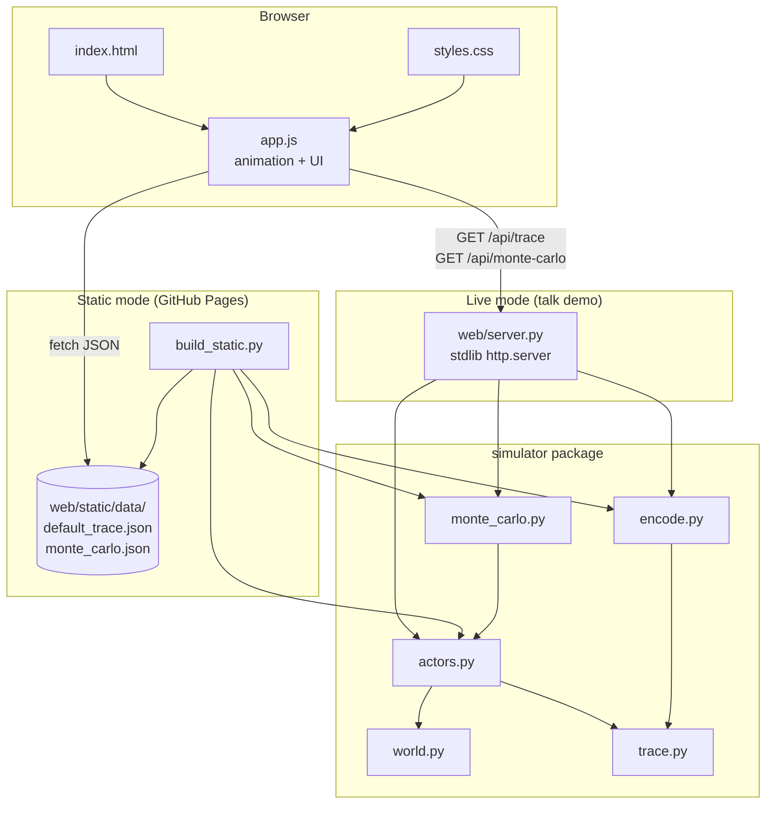

# 1: Application Design

Source: `aisdlc-docs/inception/1-user-stories.md`. Authoritative phrasing & tone direction: `aisdlc-docs/inception/1-requirements.md` § Authoritative Phrasing.

This document captures architecture decisions, component layout, the JSON contract that bridges Python simulator and browser UI, and the data model. It is the input for Phase 4 unit decomposition.

---

## Architecture Decisions

### ADR-1: Static export uses pre-rendered JSON, not a JS port of the simulator

- **Context:** Story 5 requires that blog readers experience the divergence trace from a static GitHub Pages snapshot with no Python runtime. Story 4 requires interactive parameter manipulation in the live talk demo. Both must agree on the simulation's source of truth.
- **Decision:** The Python simulator is the only implementation of the simulation. The frontend never re-implements simulation logic. For the live demo, the Python web server computes trace + Monte Carlo JSON on demand. For the static build, `build_static.py` invokes the same simulator once with the canonical seed and writes the resulting JSON to `web/static/data/`. The browser's JavaScript is a thin animation and UI layer that consumes the same JSON shape from either source.
- **Alternatives considered:**
  - *Full JS port of the simulator.* Doubles the simulator surface, creates two truths to keep in sync, and gives blog readers interactive parameters that they will not use (Story 5 acknowledges this).
  - *Hybrid (JS animator with pre-baked data, but interactive controls re-fetch JSON in static).* Static cannot fetch from a Python server, so interactive controls would still need a JS simulator. Reduces to either ADR-1's choice or full JS port; pick the simpler.
- **Consequences:** Simulator stays in one language. Static build pre-bakes one canonical seed; parameter sliders are absent or disabled in the static page (per Story 5 acceptance criterion). Blog readers get the divergence trace and the canonical Monte Carlo curve — the screenshot-grade artifacts. Interactive parameter sweep stays a live-only feature.

### ADR-2: Module layout — `simulator/` package + `web/` package + top-level entry shim

- **Context:** The v1 prototype is a single 859-line file. The new artifact must support pure-simulator imports for testing, a live HTTP server, a static build script, and a stable user-facing CLI command. v1 file is preserved as a reference per requirements Open Question; archived rather than deleted.
- **Decision:** Adopt the following layout. `simulator/` is pure Python with no I/O. `web/` owns the HTTP layer and renders to the simulator's data classes via a small JSON encoder. Both `web/server.py` (live) and `build_static.py` (static) import from `simulator/`. The top-level `agentic_security_demo.py` is a thin CLI shim that preserves the v1 entry point for Story 4 (`python agentic_security_demo.py --serve`).
  ```
  agentic-sec-new/
    README.md                        # repo-level explainer; replaces v1 README
    LICENSE                          # MIT (already on remote)
    .gitignore                       # already on remote
    agentic_security_demo.py         # CLI shim: --serve / --build-static / --demo / --monte-carlo
    build_static.py                  # writes web/static/data/*.json + copies index.html → web/dist/
    simulator/
      __init__.py                    # re-exports primary entry points
      world.py                       # ToyEnterprise + tool surface (relocated from v1)
      actors.py                      # StaticAutomation + AgenticExecutor (relocated)
      monte_carlo.py                 # capability sweep + run aggregation
      trace.py                       # dataclasses: Identity, ToolResult, Step, RunResult
      encode.py                      # dataclass → JSON-safe dict; one source of truth for the wire shape
    web/
      __init__.py
      server.py                      # stdlib http.server: serves index.html, /api/trace, /api/monte-carlo
      static/
        index.html                   # one page; sections: hero / steelman / pivot / trace / mc / equation / governance / source
        styles.css                   # hand-authored; system fonts; no external assets
        app.js                       # animation engine + UI controls; consumes JSON
        data/                        # written by build_static.py for the static deploy
          default_trace.json
          monte_carlo.json
    v1/                              # archive
      agentic_security_demo.py       # original 859-line prototype
      README.md                      # original explainer
      ARCHIVED.md                    # one-line note: superseded by repo root; kept for reference
    aisdlc-docs/
      inception/
        1-requirements.md
        1-user-stories.md
        1-design.md                  # this file
        1-units.md                   # Phase 4
  ```
- **Alternatives considered:**
  - *Single-file v2 (mirror v1 structure).* Loses testability of pure simulator; simulator and web concerns tangle.
  - *Top-level `serve.py` + `build.py` instead of CLI shim.* Breaks Story 4's preserved entry point.
  - *Move v1 into `v1/` and remove top-level shim.* Stories survive, but everyone who has the v1 README gets a 404 on the old command.
- **Consequences:** The simulator can be imported and tested without spinning up a server. The web layer owns no simulation logic. v1 is intact as a reference but unambiguous as superseded. The CLI shim ages well: when someone re-reads the v1 README, the same command still works.

### ADR-3: JSON contract — single shape used by live API and static data files

- **Context:** Live mode and static mode share a frontend. Same JSON shape must come from the live HTTP endpoint and from the pre-rendered file.
- **Decision:** Two endpoints / two files; both shapes are stable, both are produced by `simulator/encode.py`. (See § API Contracts below for full schemas.)
  - `GET /api/trace?seed=N&capability=N&max_steps=N` ↔ `web/static/data/default_trace.json`
  - `GET /api/monte-carlo?runs=N&max_steps=N` ↔ `web/static/data/monte_carlo.json`
- **Alternatives considered:**
  - *Different shapes for live and static.* Frontend would branch; brittle.
  - *Embed JSON inline in HTML (`<script type="application/json">…</script>`).* Saves one fetch but couples HTML and data; chose separate files for cleaner inspection and easy regeneration.
- **Consequences:** A reader can `curl http://127.0.0.1:8000/api/trace` (live) or open `default_trace.json` (static) and see the exact same data shape. Auditability per Story 6.

### ADR-4: Animation engine derives state from a step index, never accumulates

- **Context:** Story 2 requires playable, replayable, scrubbable, screenshot-stable frames. Reduced-motion users get the final frame instantly.
- **Decision:** The frontend holds a single integer `currentStep`. `render(currentStep)` paints both actor columns showing all steps from index 0 through `currentStep`, with the most recent step highlighted. Play increments `currentStep` on a fixed interval (default 700ms; tunable in `app.js`). Replay sets `currentStep = 0`. Reduced-motion sets `currentStep = totalSteps - 1` on first paint and disables auto-advance. A scrubber input and prev/next buttons set `currentStep` directly.
- **Alternatives considered:**
  - *CSS keyframe animation.* Harder to make screenshot-stable; reduced-motion handling is fiddlier.
  - *State machine that accumulates per-step.* Fine but more code; deterministic re-render from index is simpler and matches the simulator's own determinism.
- **Consequences:** Every frame is a pure function of `(traceData, currentStep)`. Screenshot any state; replay reproduces it. No animation glitches when scrubbing backwards.

### ADR-5: Page narrative — fixed section order, single scroll

- **Context:** Audience is CTO/eng-leader skimming on first read; success requires the thesis lands in the first viewport-and-a-half (Story 1). User explicitly proposed an ordered structure.
- **Decision:** Single-page, single-column-on-narrow / two-column-on-wide layout. Sections in this order, each a named anchor:
  1. **Hero** — title ("Same Primitives. New Control Loop."), subtitle, thesis line, byline.
  2. **Steelman** — "Why 'curl is still curl' sounds right." Plain-English concession to the primitive layer.
  3. **Pivot** — "The primitive did not change. The decision loop did." Sets up what the trace will demonstrate.
  4. **Trace** — Side-by-side divergence animation (centerpiece). Above it: "The difference is not speed. The difference is what happens after failure."
  5. **Monte Carlo** — Comparative curve with the no-speed caption.
  6. **Equation** — Old model vs. agentic model. Behind a "show math" disclosure on first paint (default collapsed, given the audience). See Open Question on equation visibility.
  7. **Governance gap** — Two-column table from requirements § Authoritative Phrasing.
  8. **Source** — Byline, repo link, MIT license, "change the seed and re-run it."
- **Alternatives considered:**
  - *Trace first, narrative after.* Hooks visually but leaves cold readers without context.
  - *Tabs / multiple pages.* Breaks scroll, hostile to forwarding and screenshotting.
- **Consequences:** Navigation is scroll position. Anchors enable deep-linking to any section ("here's the bit that matters" sharing). Page reads top to bottom on a phone or projected at 1280×720.

### ADR-6: No external runtime assets

- **Context:** Story 4 acceptance criterion: nothing fetches from the network on stage. Story 5: same constraint applies on GitHub Pages (offline-capable, fast first paint).
- **Decision:** System font stack only (`-apple-system, BlinkMacSystemFont, "Segoe UI", Roboto, …`). Icons and small visualizations as inline SVG inside the HTML or as same-origin assets under `web/static/`. No webfonts, no CDN scripts, no analytics, no telemetry.
- **Alternatives considered:** Any of the above. Each invites a network failure on stage or a tracker on a personal artifact.
- **Consequences:** Visual style is constrained to what system fonts can do. Acceptable; the page is meant to look spare and read clearly, not flashy.

### ADR-7: v1 archived to `v1/` subdirectory; not deleted

- **Context:** Requirements Open Question. v1 is referenceable evidence of the simulation's prior shape, useful when the author later wants to show "this is how the toy was first sketched."
- **Decision:** Move `agentic_security_demo.py` and `README_agentic_security_demo.md` into `v1/`, add a one-line `v1/ARCHIVED.md`. Do not import from `v1/` in the new code; it is reference material.
- **Alternatives considered:** Delete v1; keep at top level. Delete loses the snapshot; top level confuses casual readers.
- **Consequences:** Repo root reads as the canonical artifact; v1 is one click away if anyone needs it.

---

## Component Diagram

### ASCII

```
                              +-------------------------------+
                              |          Browser (UI)         |
                              |                               |
                              |   web/static/index.html       |
                              |   web/static/styles.css       |
                              |   web/static/app.js           |
                              |     - render(traceData, idx)  |
                              |     - play / pause / scrub    |
                              |     - reduced-motion handling |
                              +--------+----------------+-----+
                                       |                |
                          live mode    |                |   static mode
            GET /api/trace             |                |   fetch /static/data/default_trace.json
            GET /api/monte-carlo       |                |   fetch /static/data/monte_carlo.json
                                       v                v
              +------------------------------+    +------------------------------+
              |       web/server.py          |    |     build_static.py          |
              |   stdlib http.server         |    |   (one-shot)                 |
              |   serves /, /static/*,       |    |   produces                   |
              |   /api/trace, /api/monte-... |    |   web/static/data/*.json     |
              +--------------+---------------+    +--------------+---------------+
                             \                                  /
                              \                                /
                               v                              v
                              +-------------------------------+
                              |          simulator/           |
                              |  pure Python, deterministic   |
                              |                               |
                              |   world.py    (ToyEnterprise) |
                              |   actors.py   (Static, Agent) |
                              |   monte_carlo.py              |
                              |   trace.py    (data model)    |
                              |   encode.py   (→ JSON dict)   |
                              +-------------------------------+
```

### Mermaid



---

## API Contracts

Both endpoints serve `Content-Type: application/json`. Static deploy persists the same shapes to disk under `web/static/data/`.

### GET /api/trace

**Query parameters** (all optional, all bounded server-side):
- `seed` — int, default `7`
- `capability` — int 1–5, default `4`
- `max_steps` — int 2–20, default `8`

**Response shape:**
```json
{
  "params": { "seed": 7, "capability": 4, "max_steps": 8 },
  "goal": "Retrieve the fictional board forecast summary",
  "actors": [
    {
      "name": "Static automation",
      "kind": "static",
      "succeeded": false,
      "detected": false,
      "stopped_reason": "Stopped because the fixed path returned an error.",
      "steps": [
        {
          "index": 0,
          "tool": "direct_vault_read",
          "reason": "Fixed script path: try the direct vault endpoint.",
          "status": 403,
          "observation": "403 Forbidden: direct vault access requires finance_admin.",
          "detection_probability": 0.14,
          "detected_after_step": false,
          "sensitive_exposure": false,
          "memory_after_step": []
        }
      ]
    },
    {
      "name": "Agentic executor",
      "kind": "agentic",
      "succeeded": true,
      "detected": false,
      "stopped_reason": "Impact achieved through an alternate legitimate-looking tool chain.",
      "steps": [
        {
          "index": 0,
          "tool": "direct_vault_read",
          "reason": "Start with the most direct tool for the objective.",
          "status": 403,
          "observation": "403 Forbidden: direct vault access requires finance_admin.",
          "detection_probability": 0.14,
          "detected_after_step": false,
          "sensitive_exposure": false,
          "memory_after_step": [
            "Adaptation note: direct_vault_read returned 403; try another path."
          ]
        }
      ]
    }
  ]
}
```

`memory_after_step` is the agent's accumulated memory log as of the end of that step; for the static actor it is always `[]`. The frontend uses this to render the "agent annotates the 403" moment in Story 2's acceptance criterion.

### GET /api/monte-carlo

**Query parameters:**
- `runs` — int 50–5000, default `500`
- `max_steps` — int 2–20, default `8`

**Response shape:**
```json
{
  "params": { "runs": 500, "max_steps": 8 },
  "rows": [
    {
      "capability": 1,
      "static_success_rate": 0.0,
      "agent_success_rate": 0.18,
      "static_detection_rate": 0.14,
      "agent_detection_rate": 0.06,
      "static_avg_steps": 1.0,
      "agent_avg_steps": 7.4
    }
  ]
}
```

Five rows for capabilities 1–5.

### Static asset routes (live server)

- `GET /` → `web/static/index.html`
- `GET /static/styles.css`, `GET /static/app.js` → corresponding files
- `GET /static/data/*.json` → present in static deploy only; live server has these as well after a `build_static.py` run, but the live page prefers `/api/*` when it detects the server is alive.

---

## Data Model

Pure Python dataclasses in `simulator/trace.py`. No persistence; instances live for the duration of one HTTP request or one `build_static.py` invocation. JSON shape is produced by `simulator/encode.py` and is the only externally-visible contract — internal field names can change without breaking the frontend, as long as the encoder maps them.

| Class | Fields | Notes |
|---|---|---|
| `Identity` | `name: str`, `role: str`, `scopes: frozenset[str]` | Frozen; one default identity (`internal_ai_assistant`, `employee` role, common SaaS scopes). |
| `ToolResult` | `tool: str`, `status: int`, `observation: str`, `detection_probability: float`, `sensitive_exposure: bool` | Returned by `ToyEnterprise` tool methods. |
| `Step` | `actor: str`, `tool: str`, `reason: str`, `status: int`, `observation: str`, `detection_probability: float`, `detected_after_step: bool`, `sensitive_exposure: bool`, `memory_after_step: list[str]` | One row in a trace. `memory_after_step` is new in v2 (v1 didn't expose it). |
| `RunResult` | `name: str`, `kind: Literal['static', 'agentic']`, `goal: str`, `steps: list[Step]`, `succeeded: bool`, `detected: bool`, `stopped_reason: str` | One actor's full run. |
| `MonteCarloRow` | `capability: int`, `static_success_rate`, `agent_success_rate`, `static_detection_rate`, `agent_detection_rate`, `static_avg_steps`, `agent_avg_steps` | One capability bucket. |
| `MonteCarloResult` | `params: dict`, `rows: list[MonteCarloRow]` | Full sweep. |

No database, no filesystem state beyond the static-build output.

---

## Open Design Questions

These do not block Phase 4 unit decomposition; flag at design hand-off so the answer is decided before the relevant unit lands.

- **Equation visibility default.** ADR-5 currently puts the equation behind a `<details>` "show math" disclosure, collapsed. For the CTO/eng-leader audience that's the right default; for the conference talk on stage, the author may want it expanded. Either we land on collapsed-by-default + expand-on-demand (single source of truth), or we add a query param (`?math=expanded`) the live server respects. Decision needed before Unit "page narrative + sections."
- **Animation step interval.** ADR-4 names 700ms as the default. Real test on a projector may want 1000ms (more deliberate) or 500ms (less belabored). Tune empirically during implementation; not a unit-of-work-blocking decision.
- **Number of pre-rendered seeds in static build.** Currently one canonical seed. If the static page should let blog readers click "show me a different run," `build_static.py` produces 3–5 seeds and the JS picks one randomly on load. Costs a small bump in static asset size and one extra Phase 4 unit.
- **Detection rate framing.** v1 surfaces `detection_probability` and `detected_after_step` per step. The artifact's argument is about success/path-discovery, not detection. Decide whether to surface detection inline in the trace UI (more accurate to the simulator) or hide it for the page narrative (cleaner argument). Defer to copy/UI unit.
- **Hostile-actor framing in copy.** The simulation is structurally a confused-deputy / delegated-authority scenario, but the v1 narrative calls it "an internal AI assistant retrieving a forecast." For the CTO audience, that ambiguity is useful; for a hostile reader it raises "is this benign or attacker?" Resolve in copy unit.
