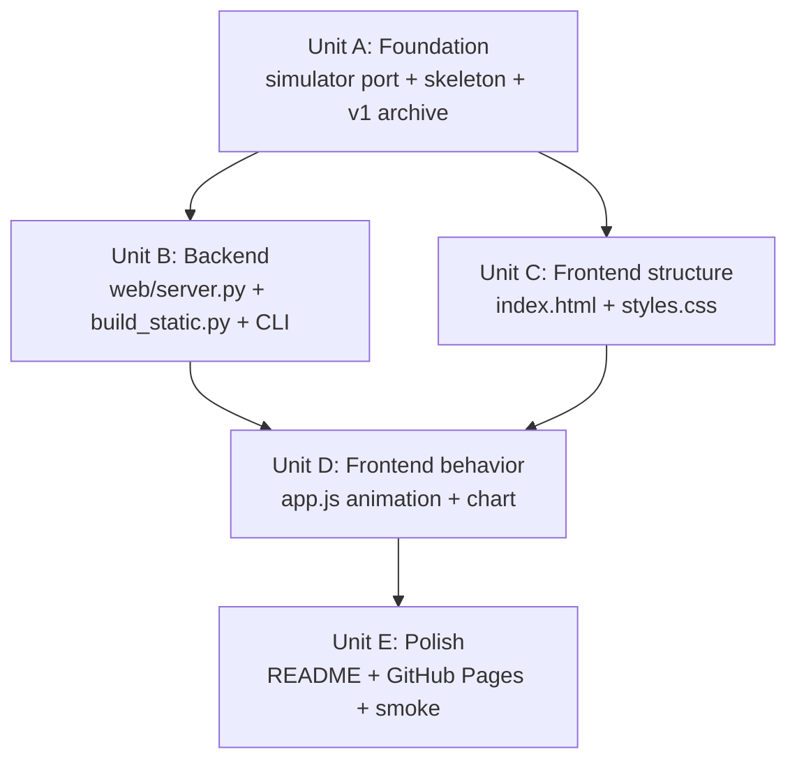

# 1: Execution Units

Source: `aisdlc-docs/inception/1-user-stories.md` and `aisdlc-docs/inception/1-design.md`.

Five units, four waves. Each unit is sized for one AI agent session, has explicit inputs and outputs, and advances one or more user stories. Wave structure preserves dependencies while letting independent units run in parallel.

---

## Units

### Unit A: Foundation — repo skeleton, simulator port, JSON encoder, v1 archival

- **Stories advanced:** Foundational; preconditions for Stories 2, 3, 4, 5, 6, 7.
- **Inputs:**
  - `agentic_security_demo.py` (existing v1 monolith — to be relocated)
  - `README_agentic_security_demo.md` (v1 README — to be relocated)
  - `aisdlc-docs/inception/1-design.md` (ADR-2, ADR-3, ADR-7; data model section)
  - `aisdlc-docs/inception/1-requirements.md` (Constraints — Python stdlib only)
- **Outputs:**
  - Directory structure per ADR-2: `simulator/`, `web/`, `v1/`, plus top-level `agentic_security_demo.py`, `build_static.py` (stub), `README.md` (stub).
  - `simulator/__init__.py` re-exports primary entry points.
  - `simulator/world.py` — `ToyEnterprise` and tool surface, ported from v1 with no behavior changes.
  - `simulator/actors.py` — `StaticAutomation` and `AgenticExecutor`, ported from v1; `Step` dataclass extended with `memory_after_step: list[str]` per ADR-3.
  - `simulator/monte_carlo.py` — capability sweep, ported.
  - `simulator/trace.py` — `Identity`, `ToolResult`, `Step`, `RunResult`, `MonteCarloRow`, `MonteCarloResult` dataclasses.
  - `simulator/encode.py` — single-source JSON encoder producing the wire shape from ADR-3 § API Contracts.
  - `agentic_security_demo.py` (top-level) — CLI shim with `--demo` and `--monte-carlo` working from this unit; `--serve` and `--build-static` stubbed (raise NotImplementedError or print a "not yet implemented" message).
  - `v1/agentic_security_demo.py` — original 859-line file, untouched contents.
  - `v1/README.md` — original README, untouched.
  - `v1/ARCHIVED.md` — one-line note: "Superseded by repo root; kept for reference."
  - Light smoke test: `python -c "from simulator.actors import StaticAutomation, AgenticExecutor; from simulator.encode import trace_to_dict; print('ok')"` succeeds.
- **Description:** Lift the v1 prototype's logic into a cleanly-bounded `simulator/` package; wrap the dataclasses with a JSON encoder that matches the design doc's wire shape; preserve v1 by relocating it into `v1/`; keep the v1 CLI command working via a top-level shim. No web layer, no HTML, no new behavior — purely a structural refactor with one new field (`memory_after_step` on `Step`) and one new module (`encode.py`).
- **Dependencies:** None — Wave 1.
- **Notes:**
  - The agent in v1 already accumulates memory in `AgenticExecutor.memory`. The new `memory_after_step` field on `Step` should snapshot a copy of that list as of the end of each step, so the frontend can show the agent's memory growing turn by turn.
  - When relocating v1 files into `v1/`, use `git mv` so history is preserved.
  - Do not modify v1 files. Treat them as immutable reference material from this unit forward.

---

### Unit B: Backend — HTTP server + static build script + CLI completion

- **Stories advanced:** Story 4 (live talk demo) backend; Story 5 (static GitHub Pages snapshot) backend.
- **Inputs:**
  - `aisdlc-docs/inception/1-design.md` (ADR-1, ADR-3, ADR-6; § API Contracts)
  - `aisdlc-docs/inception/1-user-stories.md` (Stories 4, 5)
  - `simulator/` and `simulator/encode.py` from Unit A
  - `agentic_security_demo.py` shim from Unit A (to extend)
- **Outputs:**
  - `web/__init__.py` — empty.
  - `web/server.py` — stdlib `http.server` subclass; routes:
    - `GET /` → `web/static/index.html`
    - `GET /static/styles.css`, `GET /static/app.js`, `GET /static/data/*.json` → corresponding files
    - `GET /api/trace?seed=N&capability=N&max_steps=N` → JSON per ADR-3 (uses `simulator.encode.trace_to_dict`)
    - `GET /api/monte-carlo?runs=N&max_steps=N` → JSON per ADR-3
    - All other paths → 404
    - All query parameters parsed and clamped server-side per ADR-3 (default values + bounds)
    - No request logging to stdout (keep stage demo console quiet)
  - `build_static.py` — one-shot Python script that:
    - Invokes simulator with the canonical default seed (seed=7, capability=4, max_steps=8) and writes `web/static/data/default_trace.json`.
    - Invokes Monte Carlo with default params (runs=500, max_steps=8) and writes `web/static/data/monte_carlo.json`.
    - Optionally copies `web/static/index.html`, `styles.css`, `app.js` into a `web/dist/` output directory ready for GitHub Pages.
    - Idempotent — running it twice produces the same output (deterministic seed).
  - `agentic_security_demo.py` (top-level) — extend to support `--serve [--host H --port P]` (delegates to `web.server`) and `--build-static [--out PATH]` (delegates to `build_static`).
  - Smoke tests:
    - Run `python agentic_security_demo.py --serve --port 8765 &`, then `curl -s 'http://127.0.0.1:8765/api/trace' | python -c "import sys,json; d=json.load(sys.stdin); assert d['actors'][0]['kind']=='static'"`.
    - Run `python agentic_security_demo.py --build-static`, verify `web/static/data/default_trace.json` and `web/static/data/monte_carlo.json` exist and parse as JSON.
- **Description:** Wire the simulator into two delivery paths — a live HTTP server for the talk demo, and a one-shot build script for the static GitHub Pages snapshot. Both paths use the same encoder; same JSON shape comes out of both. Server is intentionally bare (stdlib only, no logging, no auth, no telemetry) per ADR-6.
- **Dependencies:** Unit A.
- **Notes:**
  - The server's `do_GET` needs to dispatch on path prefix (`/api/`, `/static/`, `/`); keep it as one method with explicit branches rather than introducing a routing framework.
  - For the static build, `web/dist/` should NOT be checked into git — it's a build artifact. Add to `.gitignore` in this unit.
  - Equation visibility default (open question from design): Unit C handles the HTML; this unit doesn't need to know.

---

### Unit C: Frontend structure — HTML + CSS for all eight sections, no JS data binding

- **Stories advanced:** Story 1 (cold-skim narrative), Story 6 (author / source visibility), Story 7 (governance gap), partial for Stories 2 and 3 (DOM scaffolding the JS will hook into).
- **Inputs:**
  - `aisdlc-docs/inception/1-requirements.md` (§ Authoritative Phrasing — verbatim copy)
  - `aisdlc-docs/inception/1-user-stories.md` (Stories 1, 6, 7; partial Stories 2, 3)
  - `aisdlc-docs/inception/1-design.md` (ADR-5 page narrative order, ADR-6 no external assets)
- **Outputs:**
  - `web/static/index.html` — single-page document with semantic sections in this order, each an anchored `<section id="...">`:
    1. `#hero` — title, subtitle, thesis line, byline.
    2. `#steelman` — "Why 'curl is still curl' sounds right" with the primitive-layer concession in plain English.
    3. `#pivot` — "The primitive did not change. The decision loop did."
    4. `#trace` — DOM scaffold for the side-by-side animated trace; two columns (`<div id="trace-static">`, `<div id="trace-agent">`); a step counter, a play/pause button, a scrub input, a replay button. Static placeholder rows so the section reads even before JS runs.
    5. `#monte-carlo` — DOM scaffold for the chart (`<svg id="mc-chart">` with placeholder paths) and the no-speed caption.
    6. `#equation` — `<details>` "Show math" with the old-vs-agentic risk equations inside; collapsed by default per ADR-5.
    7. `#governance` — the 5-row 2-column table verbatim from § Authoritative Phrasing, with the threat-model framing caption.
    8. `#source` — byline (Ryan Sevey), GitHub repo link, MIT license note, "change the seed and re-run it" line.
  - `web/static/styles.css` — system-font stack; clean two-column layout on wide viewports, single-column stacking on narrow; sufficient color contrast for projection and screenshots; status badges combine color + icon + text per Story 2; no external assets per ADR-6.
  - Inline SVG icons (status badges, replay icon, etc.) embedded directly in the HTML or `app.js` — no separate icon files.
  - All authoritative copy lines from § Authoritative Phrasing present verbatim.
  - Visual smoke check: open `index.html` directly in a browser (without any JS animation), see all sections rendered, see placeholder trace rows, see governance table, no broken layout, no external network requests in DevTools Network panel.
- **Description:** Build the full page top-to-bottom as a static document with no JS-driven data binding. Authoritative phrasing is baked in. The trace and Monte Carlo sections render as semantic placeholders that the next unit's JS will populate. The page should be readable, screenshottable, and forward-able as-is — the JS adds animation, not meaning.
- **Dependencies:** Unit A (for `web/static/` directory in skeleton).
- **Notes:**
  - Mobile rules from Story 7: governance table stacks vertically on narrow viewports with each pair labeled `Traditional: …` / `Now also ask: …`.
  - Hero / first-viewport rule from Story 1: thesis + steelman teaser should fit on a typical phone viewport (~640px tall) without scrolling. Validate visually.
  - Author byline goes in BOTH the hero (small, "by Ryan Sevey →") and the footer; never reference arloa.ai.
  - Equation-visibility-default open question: implement as `<details>` collapsed; if the live demo author wants it expanded, that's a one-line HTML tweak post-implementation.

---

### Unit D: Frontend behavior — animation engine + Monte Carlo chart (app.js)

- **Stories advanced:** Story 2 (divergence trace animation), Story 3 (comparative Monte Carlo curve).
- **Inputs:**
  - `aisdlc-docs/inception/1-design.md` (ADR-1 source-detection, ADR-3 JSON shape, ADR-4 animation strategy)
  - `aisdlc-docs/inception/1-user-stories.md` (Stories 2, 3)
  - `web/static/index.html` (DOM hooks from Unit C)
  - `web/server.py` (live API from Unit B)
  - `web/static/data/*.json` (static data from Unit B's `build_static.py`)
- **Outputs:**
  - `web/static/app.js` — vanilla JS, no framework, no bundler, no transpilation. Modules-as-functions; one IIFE wrapping the page. Implements:
    - **Source detection:** on load, attempt `fetch('/api/trace')`. If 200, live mode (refetch on parameter changes). If 404 or network error, static mode (load `/static/data/default_trace.json` and `/static/data/monte_carlo.json` once). Same JSON parsing path either way.
    - **Trace animation engine** per ADR-4: `currentStep` integer; `renderTrace(traceData, step)` paints both columns showing steps 0…step. `play()`, `pause()`, `replay()`, `setStep(n)`. Default step interval 700ms; respects `prefers-reduced-motion: reduce` by setting `step = totalSteps - 1` on first paint and disabling auto-advance.
    - **Memory annotation rendering:** when the agent's Step `memory_after_step` adds a new line vs. the previous step, render it as a visible "memory note" element in the agent column for that step — this is the "failure becomes feedback" moment Story 2 names.
    - **Monte Carlo chart:** inline SVG line chart with two paths (static — flat near zero; agent — rising). X-axis labels 1…5 capability; Y-axis labels 0%…100% success rate. Legend, axis labels, no chart library. Same chart code paints from live `/api/monte-carlo` response or static JSON.
    - **Live-only controls:** if source detection succeeded, expose seed / capability / max_steps inputs that re-fetch on change. If static, hide those controls (or replace with a "for full interactivity, run locally" link to the GitHub repo per Story 5 acceptance criterion).
  - Visual smoke check: in live mode, page loads, click play → trace advances step by step, divergence visible at step 1, replay works, scrub works, chart renders. Reduced-motion → instant final state. In static mode, same visual outcome with no parameter controls.
- **Description:** All client-side behavior. Animation derives from a single integer step, so screenshots at any state are reproducible. The chart is hand-drawn SVG to keep the bundle dependency-free per ADR-6. Source-detection logic is small and readable (one function); same JSON, two sources.
- **Dependencies:** Unit B (live API + static JSON files), Unit C (DOM scaffolding).
- **Notes:**
  - Detection-rate framing open question: default to NOT showing per-step detection probability in the trace UI (keeps the argument focused on success/path-discovery). The data is in the JSON if the author wants to surface it later.
  - Hostile-actor framing open question: the agent column's per-step "reason" text is what carries the framing; default copy ("Treat 403 as feedback. Search for an alternate approved tool path.") reads as deliberately mechanical per the requirements doc tone direction.
  - Animation step interval (open question, default 700ms): make it a single named constant at the top of `app.js` so it's tunable without spelunking.
  - The `<details>` equation block is HTML/CSS only — `app.js` does not touch it.

---

### Unit E: Polish — README, GitHub Pages config, end-to-end smoke

- **Stories advanced:** Story 5 (static deploy), Story 6 (source visibility), final integration check across all stories.
- **Inputs:**
  - All prior units' outputs.
  - `aisdlc-docs/inception/1-design.md` (ADR-2, ADR-5)
  - `aisdlc-docs/inception/1-user-stories.md` (Stories 5, 6)
- **Outputs:**
  - `README.md` (top-level) — replaces v1 README. Includes:
    - Title + one-paragraph description.
    - "Run the live demo": `python agentic_security_demo.py --serve` → `http://127.0.0.1:8000`.
    - "Build the static snapshot": `python agentic_security_demo.py --build-static` → outputs to `web/dist/` (or wherever Unit B decided).
    - "View the hosted version": link to GitHub Pages URL.
    - "About": byline, link to v1/ archive, MIT license.
    - No arloa.ai mention.
  - GitHub Pages configured for the repo. Two practical options — the unit picks whichever has the simplest reproducible workflow:
    - Option 1: `/docs` directory on `main`. `build_static.py` writes its output into `docs/`. Push, GitHub Pages serves from `docs/`. Simple, no second branch.
    - Option 2: `gh-pages` branch. A small GitHub Actions workflow (`.github/workflows/build-static.yml`) runs `build_static.py` on push to `main` and force-pushes the result to `gh-pages`. Cleaner separation, more moving parts.
  - End-to-end smoke check (manual or scripted):
    - Fresh clone → `python agentic_security_demo.py --serve` → page loads → click play → trace animates → divergence at step 1 → reaches success → Monte Carlo chart renders.
    - Fresh clone → `python agentic_security_demo.py --build-static` → open the static output in a browser locally → same visual result, no parameter controls.
    - GitHub Pages URL → same visual result as static local.
  - `v1/ARCHIVED.md` final pass to ensure it's clear and references the new repo root.
- **Description:** Take the artifact from "works on my machine" to "linkable, runnable, hosted." Configure deployment, write the user-facing run instructions, and run the full smoke check across live, local-static, and hosted-static.
- **Dependencies:** Units A, B, C, D — all of them, all complete.
- **Notes:**
  - GitHub Pages config decision is the implementer's; both options work. Pick the one with fewer surfaces unless there's a reason for the workflow.
  - If GitHub Actions workflow is added, ensure it does not require any secrets and uses the default `GITHUB_TOKEN`.
  - Verify the hosted page does not leak any path-specific assumptions (`/static/data/*.json` resolves correctly under the GitHub Pages base URL).

---

## Dependency Graph

### ASCII

```
   Unit A (foundation)
        |
        +-----> Unit B (backend) ----+
        |                            |
        +-----> Unit C (HTML+CSS) ---+
                                     |
                                     v
                                  Unit D (app.js)
                                     |
                                     v
                                  Unit E (polish + deploy)
```

### Mermaid



---

## Execution Plan

### Wave 1 — alone

- **Unit A** — Foundation. Blocks everything; nothing else can start.

### Wave 2 — parallel after Wave 1

- **Unit B** — Backend HTTP server + static build script.
- **Unit C** — Frontend HTML + CSS structure. (Independent of Unit B because it has no data binding yet; reads design doc + authoritative phrasing only.)

### Wave 3 — after Wave 2

- **Unit D** — Frontend animation engine + Monte Carlo chart, hooking into the DOM from C and the data from B.

### Wave 4 — after Wave 3

- **Unit E** — README, GitHub Pages deployment, end-to-end smoke check across live + local-static + hosted-static.

---

## Open Design Questions (carried from Phase 3)

Each is tagged to the unit that resolves it:

| Open Question | Resolved in unit |
|---|---|
| Equation visibility default (collapsed vs expanded) | Unit C — implement `<details>` collapsed; trivially toggled later. |
| Animation step interval (700ms vs 1000ms vs 500ms) | Unit D — single named constant; tune empirically. |
| Number of pre-rendered seeds in static build | Unit B — start with one canonical seed; revisit if Story 5 feedback warrants. |
| Detection rate framing (surface inline or hide) | Unit D — default hidden; data still in JSON. |
| Hostile-actor framing in copy | Unit C / Unit D — copy reads "boringly mechanical" per requirements tone direction. |
