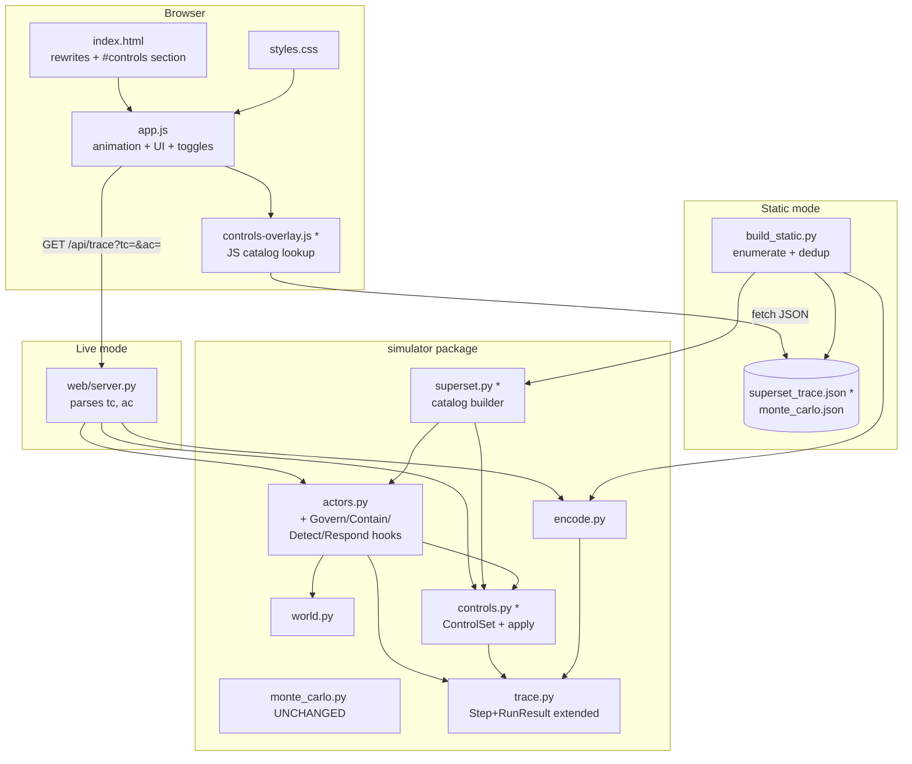

# 7: Application Design

Source: `aisdlc-docs/inception/7-user-stories.md`. Inherits architecture from `1-design.md` except where the ADRs below explicitly update it.

This is a delta design — the simulator package layout, the `web/` layout, the JSON envelope shape, and the deployment story all carry over. New material: a `Control` data model + control-evaluation function in the simulator, an extended trace JSON shape that exposes the agent's branching choices, a small JS overlay that reuses the same control-evaluation logic for static-mode toggle interactivity, and three rewritten copy sections.

---

## Architecture Decisions

### ADR-7-1: Controls are first-class simulator objects

- **Context:** Story 2 and Story 3 require the simulator to model 8 traditional + 4 agentic controls, each with deterministic effects on tool calls, agent behavior, or post-execution signals. Controls must be addressable by ID (so the wire shape and the toggle UI agree on names) and must be cleanly enable/disable-able.
- **Decision:** Introduce `simulator/controls.py`. Defines a `Control` dataclass (`id: str`, `kind: Literal["traditional","agentic"]`, `label: str`, `parenthetical: str`, `binding: ControlBinding`). Defines a `ControlSet` (an immutable frozenset of enabled control IDs + a small lookup index). Defines a single function `apply_to_tool_call(controls: ControlSet, tool: str, identity: Identity, base_result: ToolResult) -> ControlAdjustedResult` — given a base `ToolResult` from the existing `ToyEnterprise`, return what the agent actually observes after enabled controls have applied. Adjustments are *layered*, not replacements: e.g., MFA on direct_vault_read overrides the status to 401; DLP on analytics_report keeps status 200 but redacts `observation` and clears `sensitive_exposure`.
- **Alternatives considered:**
  - *Inline control checks inside each `ToyEnterprise` tool method.* Couples controls to tool definitions; control logic ends up scattered across 6 methods; hard to add new controls.
  - *A subclass `GuardedToyEnterprise` per toggle combination.* Combinatorial; impractical for 12 toggles.
  - *Decorator/middleware pattern on `call_tool`.* Workable but obscures the linear "tool returned X, controls adjusted to Y" reasoning that the trace UI exposes.
- **Consequences:** All control logic lives in one file. `ToyEnterprise` is unmodified except for `call_tool` calling through `apply_to_tool_call` when a `ControlSet` is provided. The agent (`AgenticExecutor`) is unmodified at the tool-call-result-handling layer — it sees an adjusted `ToolResult` and reacts the same way it does today (treat 401/403/404/429 as feedback, retry alternate path).

### ADR-7-2: Agentic controls hook in at three distinct layers

- **Context:** Govern, Contain, Detect, and Respond are categories of *question*; each needs a distinct behavioral hook for the user to *see* what each interrupts.
- **Decision:**
  - **Govern** — pre-execution. `AgenticExecutor.run()` consults `controls` *before* the loop starts. If Govern is enabled, the agent emits a single synthetic step with `tool="<govern>"`, `status=0`, `observation="Objective + identity + tool chain not authorized."`, then returns. The `agentic_halt_reason` field is set to `"govern"`. No tool calls execute.
  - **Contain** — cross-tool sequence counter. Tracks number of *distinct* tools used in the run; when the count would exceed 2 (configurable, baked-in default), emits a synthetic terminating step with `tool="<contain>"`, `status=0`, `observation="Cross-tool sequence limit reached."`, sets `agentic_halt_reason="contain"`. The first 1–2 tools succeed; the chain breaks at the transition.
  - **Detect** — post-step observer. After each step is appended to the trace, if Detect is enabled and the step's tool is part of an *adaptive chain* (= the agent has already had a non-200 status this run), increment `detection_signal.flagged` and add a step-level marker `step.detected_chain_pattern = True`. Does not block.
  - **Respond** — in-loop interrupt. After each step, if Respond is enabled AND the agent has just executed a "retry-after-failure" pattern (= immediately after a non-200 step the agent issued a different tool call), emit a synthetic terminating step `tool="<respond>"`, `status=0`, `observation="Retry-after-failure pattern interrupted."`, sets `agentic_halt_reason="respond"`. Halts strictly *after* the first retry, so the agent's first failure-as-feedback is still visible.
- **Alternatives considered:**
  - *Implement all four agentic controls as adjustments to `apply_to_tool_call` (i.e., make them ControlBindings on tools).* Tempting for symmetry, but agentic controls operate on the *trajectory*, not on individual tool calls. Forcing them into the per-call adjustment hook would obscure their distinctive layer.
  - *Implement Govern as a check on the goal + identity at construction time.* Same outcome, but the synthetic-step approach renders identically to other halts in the trace UI; no special-case code in the renderer.
- **Consequences:** Each agentic control has a clearly documented hook point in `AgenticExecutor.run()`. The traditional/agentic distinction in the simulator mirrors the page's argument: traditional controls modify what the agent observes from a single tool call; agentic controls modify what trajectories are allowed at all.

### ADR-7-3: Static deploy uses a "trace catalog" — pre-rendered unique paths keyed by response pattern

- **Context:** Story 5 requires full toggle interactivity in static mode. ADR-1 of #1 forbade a JS port of the simulator; that decision was correct for v1 (no toggles) but no longer covers the new section. Pre-rendering all 2^12 = 4096 toggle combinations is wasteful (most produce identical paths) and ~4 MB; shipping the agent's path-search to JS doubles the simulator surface.
- **Decision:** This ADR *narrowly updates* #1's ADR-1. The path-search algorithm stays Python-only. For static deploy, `build_static.py` enumerates the agent's behavior under all 4096 toggle combinations, deduplicates by trace, and writes a *trace catalog* — a list of unique traces, each tagged with the set of toggle states that produce it. The JS overlay (`web/static/controls-overlay.js`, ~80–150 lines) takes the toggle state, computes the canonical key, and looks up the matching catalog entry. The JS does not re-implement the agent's path-search — only the lookup. `apply_to_tool_call` does NOT live in JS; the catalog is the JS-visible contract.
  - Worst case (every combo produces a unique path under the canonical seed): catalog has 4096 entries; estimated size ~500 KB gzipped, exceeds the ~150 KB target. Unlikely in practice — preliminary estimate is 10–60 unique paths because most controls don't change the agent's path under the canonical seed.
  - If the catalog exceeds 150 KB gzipped, the build script bisects: keep entries reachable from "interesting" toggle subsets (single-toggle states, all-traditional, all-agentic, common pairs), mark the rest as `fallback="run-locally"`. The static overlay shows the `Story 5 AC` "this combination requires the live demo" note for fallback combinations. This is the only place the static experience can degrade.
- **Alternatives considered:**
  - *Full JS port of the agent's path-search.* Doubles the simulator surface; drift risk; ~300+ lines in JS.
  - *Narrow JS port — JS reimplements `apply_to_tool_call` and re-runs the agent's loop in JS.* Half as much JS but still doubles the agent's loop logic.
  - *Pre-render every combination, no dedup.* 4 MB+, untenable on mobile.
- **Consequences:** ADR-1 of #1 stands for the simulator's path-search, but the *static-mode interactivity surface* now includes a small JS overlay scoped to lookup. The catalog generation is a build-time concern; runtime is just JSON parse + dictionary lookup. Drift between Python and JS is structurally impossible because the JS does not implement the simulator — only the catalog lookup.

### ADR-7-4: Tool-binding for traditional controls — against the existing 6-tool surface

- **Context:** The requirements doc named the 8 traditional controls with proposed tool-bindings (e.g., "MFA on direct_vault_read"). The existing tool surface in `simulator/world.py` is `direct_vault_read`, `search_wiki`, `search_chat`, `data_catalog_search`, `analytics_report`, `open_ticket` — no `file_search`, no `outbound_mail`, no `sensitive_export`. Bindings need to be against real tools.
- **Decision:** Final bindings:

  | Control ID | UI label | Tool / target | Effect on `ToolResult` |
  |---|---|---|---|
  | `mfa_vault` | MFA on direct_vault_read | `direct_vault_read` | Status → 401; observation → "401 Step-up required: direct vault access requires interactive MFA." |
  | `segment_vault` | Network segmentation on direct_vault_read | `direct_vault_read` | Status → 0 (no-route); observation → "Connection refused: direct vault is segmented from this identity's network zone." |
  | `least_priv_catalog` | Least-privilege: drop `catalog:read` | identity scopes (drops `catalog:read`) | `data_catalog_search` returns 403 on its scope check (existing behavior). Encoded by removing the scope from the identity passed to `call_tool`. |
  | `audit_log` | Audit logging on all calls | global | No `ToolResult` change. `RunResult.detection_signal.logged += 1` per step. |
  | `rate_limit_chat` | Rate-limit on search_chat | `search_chat` | Status → 429; observation → "429 Too many requests: rate-limit on search_chat (retry-after: 30s)." |
  | `approval_export` | Approval-gate on analytics_report | `analytics_report` | Status → 403; observation → "403 Awaiting human approval: analytics_report export requires manager sign-off." |
  | `dlp_export` | DLP on analytics_report response | `analytics_report` | Status stays 200; observation → "Analytics export executed; payload redacted by DLP."; `sensitive_exposure → False`. The agent observes that the data did *not* leave; counts as no-impact in the trace. |
  | `anomaly_seq` | Anomaly detection on tool sequences | global | No `ToolResult` change. After step append, if step is part of an adaptive chain (≥2 tool kinds tried this run), `detection_signal.flagged += 1`. |

- **Alternatives considered:**
  - *Add new tools (`file_search`, `send_email_external`) to widen the bindings.* Larger refactor; out-of-scope for #7's "enhancement, not v2" framing.
  - *Bind multiple controls to the same tool (3 of 8 land on `analytics_report`).* Accepted: that's accurate to real-world layered-defense practice and the toggles' effects are different (block vs redact).
- **Consequences:** No new tools added. `least_priv_catalog` is implemented by mutating the identity passed to `call_tool` (drops `catalog:read` scope before the simulator dispatches), not by changing tool methods. `audit_log` and `anomaly_seq` are signal-only — they don't change agent behavior, only the detection counter.

### ADR-7-5: Detection signal is a per-run counter pair, not per-step

- **Context:** Story 4 needs a visible signal that distinguishes *observed* from *blocked*. Two natural shapes: per-step badges or a run-level counter.
- **Decision:** `RunResult.detection_signal = {"logged": int, "flagged": int}`. `logged` counts steps where audit logging or `Detect` saw the call; `flagged` counts steps where anomaly detection or `Detect` flagged an adaptive-chain pattern. Per-step booleans are also encoded (`Step.detection_logged`, `Step.detection_flagged`) so the UI can highlight specific steps if it wants — but the section's primary signal is the run-level pair, rendered as `▣ N logged · ⚠ M flagged` near the trace.
- **Alternatives considered:**
  - *Per-step badges only.* Visual noise; harder to screenshot.
  - *Run-level only, no per-step.* Loses the ability to highlight which step triggered the flag.
- **Consequences:** Two scalars in the JSON envelope. Two booleans on each step. The UI's primary readout is the pair; per-step booleans are available if/when needed.

### ADR-7-6: Page narrative — replace `#governance` with `#controls`; add an always-visible rate-race intuition above the equation `<details>`

- **Context:** Requirements answer locked the new section to replace the static governance-gap table; the equation-section open question (always-visible vs in-disclosure) is resolved here.
- **Decision:** Final section order: `#hero → #steelman → #pivot → #trace → #monte-carlo → #controls → #equation → #source`. The `#controls` section anchor replaces the old `#governance` anchor (any inbound links to `#governance` get a redirect note in the README, no JS-side handling). The `#equation` section gets a short always-visible lede paragraph above the `<details>` containing the rate-race intuition (one sentence: *"Agentic AI changes the success-to-detection *ratio*, not just the rate."* — close paraphrase from §Authoritative Phrasing) plus a "Show the math" `<summary>` opening into the full hardened equations.
- **Alternatives considered:**
  - *Keep `#governance` table as a TL;DR before `#controls`.* Story-3 acceptance criteria require the toggles to *be* the governance gap argument; a static table would now read as redundant.
  - *Move equation into `#controls`.* Mixes math with interaction; harder to skim.
- **Consequences:** README v2 mentions the `#governance` → `#controls` rename for any outside links. Equation section gets one small unconditional paragraph plus the existing `<details>`.

### ADR-7-7: Live API extends with `tc` and `ac` query params; static deploys publish a single `superset_trace.json` catalog

- **Context:** Live and static modes both need toggle state to drive trace rendering. Live mode round-trips to Python (server is authoritative). Static mode does the trace-catalog lookup in JS.
- **Decision:**
  - **Live mode.** `/api/trace` accepts two new optional query params:
    - `tc` — comma-separated traditional control IDs (e.g., `tc=mfa_vault,rate_limit_chat`).
    - `ac` — comma-separated agentic control IDs (e.g., `ac=govern`).
    - Server clamps to known IDs (unknown IDs are silently dropped). The simulator runs with the parsed `ControlSet`. Response shape is unchanged from #1's ADR-3 except that `Step` and `RunResult` carry the new fields described in §Data Model.
  - **Static mode.** `build_static.py` enumerates the 4096 toggle combinations, runs the simulator on each under canonical seed/capability, deduplicates by trace shape, and writes:
    ```
    web/static/data/superset_trace.json
    ```
    Shape:
    ```json
    {
      "params": { "seed": 7, "capability": 4, "max_steps": 8 },
      "static_actor_trace": { /* the static-automation run, identical across all combinations */ },
      "agent_traces": [
        {
          "id": 0,
          "covers": [
            { "tc": ["mfa_vault"], "ac": [] },
            { "tc": ["mfa_vault", "audit_log"], "ac": [] }
          ],
          "trace": { /* RunResult-shaped trace */ },
          "detection_signal": { "logged": 4, "flagged": 0 }
        }
      ],
      "fallback_combinations": [ { "tc": [...], "ac": [...] } ]
    }
    ```
    The JS overlay parses this once on first paint, indexes `agent_traces` by canonical control-ID-set string, and looks up the matching trace per toggle change.
- **Alternatives considered:**
  - *Embed the catalog inline in the HTML.* Saves one fetch but couples HTML and data; chose separate file per #1's ADR-3.
  - *Live mode also returns the full superset.* Wasteful; live is per-request.
- **Consequences:** One new static asset. Two new query params on `/api/trace`. JSON shape extended (additive, not breaking) with new fields on `Step` and `RunResult` plus a new top-level `detection_signal`.

### ADR-7-8: Monte Carlo chart is unchanged — controls do not propagate into MC

- **Context:** The MC chart is the "raw capability bends the slope" point. Adding 12 toggles to MC would create a UX disaster and dilute the argument.
- **Decision:** `simulator/monte_carlo.py` is untouched. `/api/monte-carlo` keeps its existing shape and behavior. The `#monte-carlo` section copy gets one new short caption clarifying that the MC sweep is over the *no-controls* baseline — controls are the next section.
- **Alternatives considered:** Per-toggle MC overlays. Rejected.
- **Consequences:** MC stays a single chart; controls live in `#controls`.

---

## Component Diagram

### ASCII

```
                              +-------------------------------------+
                              |             Browser (UI)            |
                              |                                     |
                              |   web/static/index.html             |
                              |     - rewritten #steelman/#pivot    |
                              |     - new #controls section         |
                              |     - rewritten #equation lede      |
                              |                                     |
                              |   web/static/styles.css             |
                              |   web/static/app.js                 |
                              |   web/static/controls-overlay.js *  |
                              |     - parse superset_trace.json     |
                              |     - lookup by ControlSet key      |
                              |     - hand displayed trace to app   |
                              +--------+----------------------+-----+
                                       |                      |
                          live mode    |                      |   static mode
            GET /api/trace?tc=&ac=     |                      |   fetch /static/data/superset_trace.json
            GET /api/monte-carlo       |                      |   fetch /static/data/monte_carlo.json
                                       v                      v
              +------------------------------+    +------------------------------+
              |       web/server.py          |    |     build_static.py          |
              |   stdlib http.server         |    |   (one-shot)                 |
              |   parses tc=, ac=            |    |   enumerates 2^12 combos,    |
              |   builds ControlSet          |    |   dedupes traces,            |
              +--------------+---------------+    |   writes superset_trace.json |
                             \                    +--------------+---------------+
                              \                                  /
                               v                                v
                              +------------------------------------+
                              |             simulator/             |
                              |  pure Python, deterministic        |
                              |                                    |
                              |   world.py     (ToyEnterprise)     |
                              |   actors.py    (Static, Agent;     |
                              |                 Govern/Contain/    |
                              |                 Detect/Respond     |
                              |                 hooks added)       |
                              |   controls.py  *  (Control,        |
                              |                 ControlSet,        |
                              |                 apply_to_tool_call)|
                              |   monte_carlo.py  (UNCHANGED)      |
                              |   trace.py     (Step + RunResult   |
                              |                 fields extended)   |
                              |   encode.py    (new fields encoded)|
                              |   superset.py  *  (build catalog)  |
                              +------------------------------------+

* = new file in #7
```

### Mermaid



`*` marks files new in #7.

---

## API Contracts

### GET /api/trace (extended)

**Query parameters:**
- `seed` — int, default `7` (unchanged)
- `capability` — int 1–5, default `4` (unchanged)
- `max_steps` — int 2–20, default `8` (unchanged)
- `tc` — comma-separated traditional control IDs. Allowed: `mfa_vault, segment_vault, least_priv_catalog, audit_log, rate_limit_chat, approval_export, dlp_export, anomaly_seq`. Unknown IDs silently dropped.
- `ac` — comma-separated agentic control IDs. Allowed: `govern, contain, detect, respond`. Unknown IDs silently dropped.

**Response shape — additive vs #1:**
```json
{
  "params": { "seed": 7, "capability": 4, "max_steps": 8, "tc": ["mfa_vault"], "ac": [] },
  "goal": "...",
  "detection_signal": { "logged": 0, "flagged": 0 },
  "actors": [
    { /* static actor as before */ },
    {
      "name": "Agentic executor",
      "kind": "agentic",
      "succeeded": true,
      "detected": false,
      "stopped_reason": "...",
      "agentic_halt_reason": null,
      "steps": [
        {
          "index": 0,
          "tool": "direct_vault_read",
          "reason": "...",
          "status": 401,
          "observation": "401 Step-up required: ...",
          "applied_controls": ["mfa_vault"],
          "detection_logged": false,
          "detection_flagged": false,
          "detection_probability": 0.14,
          "detected_after_step": false,
          "sensitive_exposure": false,
          "memory_after_step": ["..."]
        }
      ]
    }
  ]
}
```

**New fields:**
- Top-level `detection_signal: { logged: int, flagged: int }` — run-level counter pair (sums across the agentic actor; static actor's contributions are zero unless audit_log applies).
- Each `Step` gains `applied_controls: list[str]` (control IDs that fired on this step) and `detection_logged: bool`, `detection_flagged: bool`.
- Each agentic-kind `RunResult` gains `agentic_halt_reason: Optional[str]` ∈ `{"govern","contain","respond",null}`.
- Synthetic-step entries for Govern/Contain/Respond use `tool ∈ {"<govern>","<contain>","<respond>"}`, `status: 0`, and `applied_controls` listing the agentic control that fired.

**Backwards compatibility:** existing fields are unchanged; new fields are additive. `app.js` reads new fields where present and tolerates their absence (so #1's static deploy continues to render correctly if someone visits an old asset).

### GET /api/monte-carlo (unchanged)

No changes from #1's ADR-3.

### GET /static/data/superset_trace.json (new)

```json
{
  "params": { "seed": 7, "capability": 4, "max_steps": 8 },
  "static_actor_trace": { /* identical-shape RunResult dict */ },
  "agent_traces": [
    {
      "id": 0,
      "covers": [
        { "tc": [], "ac": [] },
        { "tc": ["audit_log"], "ac": [] }
      ],
      "trace": { /* RunResult dict */ },
      "detection_signal": { "logged": 0, "flagged": 0 }
    },
    {
      "id": 1,
      "covers": [
        { "tc": ["mfa_vault"], "ac": [] },
        { "tc": ["mfa_vault", "audit_log"], "ac": [] }
      ],
      "trace": { /* RunResult dict */ },
      "detection_signal": { "logged": 5, "flagged": 0 }
    }
  ],
  "fallback_combinations": []
}
```

`covers` lists `(tc, ac)` pairs that produce this trace. Order within each list is canonical (sorted alphabetical) so the JS overlay can compute the lookup key by sorting toggle state and matching the entry. `fallback_combinations` (often empty) lists any (tc, ac) pair the build script chose to omit when bisecting for size.

---

## Data Model

Additions to `simulator/trace.py`:

| Class | Fields added | Notes |
|---|---|---|
| `Step` | `applied_controls: List[str]` (default empty), `detection_logged: bool` (default False), `detection_flagged: bool` (default False) | Backwards-compatible; existing constructions still work. |
| `RunResult` | `agentic_halt_reason: Optional[str]` (default None), `detection_signal: Dict[str,int]` (default `{"logged":0,"flagged":0}`) | Halt reason set only by agentic-control hooks. Detection signal mutates as steps are appended. |

New classes in `simulator/controls.py`:

| Class | Fields | Notes |
|---|---|---|
| `Control` | `id: str`, `kind: Literal["traditional","agentic"]`, `label: str`, `parenthetical: str`, `binding: ControlBinding` | Pure data; no behavior on the dataclass itself. |
| `ControlBinding` | `kind: Literal["tool_status","scope_drop","detection_log","detection_flag","govern","contain","detect","respond"]`, plus kind-specific fields (e.g., `target_tool: str`, `new_status: int`, `new_observation: str`, `clear_sensitive: bool`) | One ControlBinding per Control. The `apply_to_tool_call` and the agentic hooks dispatch on `kind`. |
| `ControlSet` | `enabled: frozenset[str]`, helper methods `is_enabled(id) -> bool`, `traditional() -> frozenset[str]`, `agentic() -> frozenset[str]`, `key() -> str` | The `key()` produces the canonical lookup string used by the static catalog. |

Module-level constants in `simulator/controls.py`:

- `TRADITIONAL_CONTROLS: tuple[Control, ...]` — the 8 controls from ADR-7-4 in canonical order.
- `AGENTIC_CONTROLS: tuple[Control, ...]` — the 4 controls from ADR-7-2 in canonical order (`govern`, `contain`, `detect`, `respond`).
- `ALL_CONTROLS: tuple[Control, ...]` = traditional + agentic.
- `CONTROL_BY_ID: Dict[str, Control]` — lookup index.

No persistence; instances live for the duration of one HTTP request, one `build_static.py` invocation, or one in-memory simulator call.

---

## Open Design Questions

These do not block Phase 4; flag at design hand-off.

- **Catalog size in practice.** ADR-7-3 estimates 10–60 unique paths under canonical seed/capability. Validate during implementation; if catalog ships >150 KB gzipped, apply the bisection rule (keep "interesting" subsets, mark rest as `fallback`). The build script should print catalog size and unique-path count on each run for fast feedback.
- **`Contain` threshold (default 2).** ADR-7-2 hardcodes "block at >2 distinct tools." Tunable; if the canonical run uses exactly 2 tools to succeed, Contain at 2 is too generous (agent always succeeds). Validate in implementation; adjust to 1 if needed (or make `Contain` block on the *transition into the second-tier authority* tool — e.g., `analytics_report` after any other tool — rather than a count).
- **Govern halt-step UX.** Synthetic step with `status: 0` renders as a halt in the trace UI — confirm this reads correctly on screen (and as a screenshot) without confusion. May need a distinct visual treatment (e.g., a halt-banner row instead of a normal step row).
- **`Respond` retry detection.** Hooked on "non-200 step followed by a different tool." Edge case: agent's first call returns 401 (MFA), agent's second call is the same tool retried with different args (rare in this simulator). Confirm logic doesn't double-fire on the canonical seed.
- **Live-mode parameter persistence.** When the user toggles a control, should the URL update with `?tc=&ac=` so a refresh preserves state and the URL is shareable? Adds modest JS work. Defer to Unit-D-equivalent; default is "no, refresh resets to defaults."
- **Static-mode "uncovered combination" copy.** ADR-7-3 anticipates fallback combinations in extreme cases. If the implementer hits zero fallbacks (likely under canonical seed), the fallback UI is dead code — ship it anyway as a guard, or excise? Defer; recommend ship-it-anyway, the cost is one branch in JS.
- **Section heading copy for `#controls`.** Working title; final wording is a copy decision pulled from the authoritative phrasing in `7-requirements.md` § Authoritative Phrasing. Two strong candidates: *"Apply the controls. Watch the loop."* or *"Friction or feedback?"* — leave to the implementer of the copy unit.
