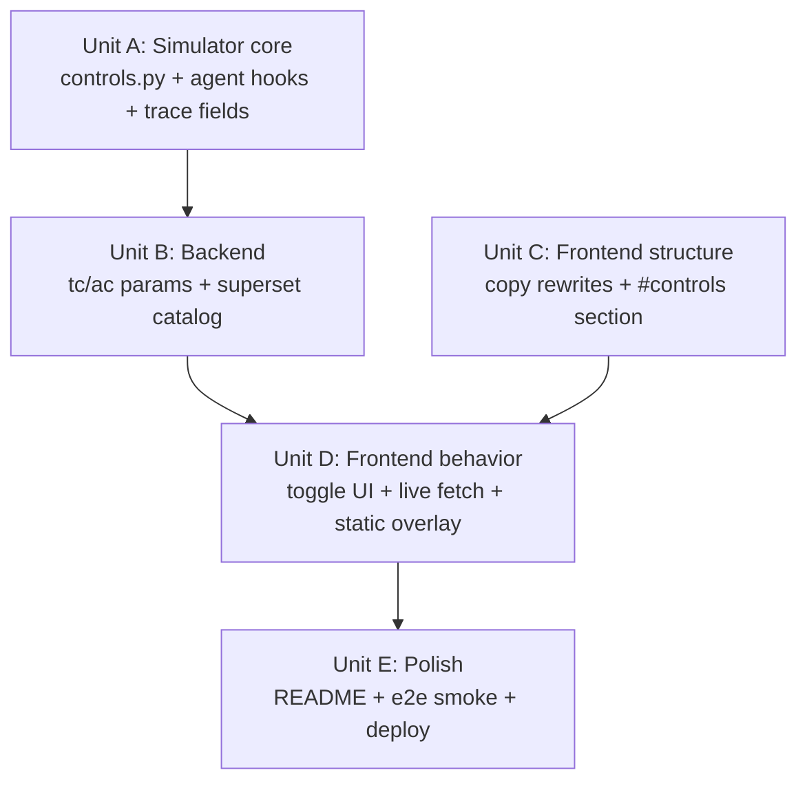

# 7: Execution Units

Source: `aisdlc-docs/inception/7-user-stories.md` and `aisdlc-docs/inception/7-design.md`.

Five units, four waves. Same structural philosophy as #1: each unit is sized for one AI agent session, has explicit inputs and outputs, and advances one or more user stories. The simulator changes (Unit A) and the copy rewrites (Unit C) are independent and run in parallel; everything else serializes against them.

---

## Unit A: Simulator core — Control model + agent hooks + extended trace fields

- **Stories advanced:** Foundational for Stories 2, 3, 4. Pre-condition for Units B, D, E.
- **Inputs:**
  - `aisdlc-docs/inception/7-design.md` (ADR-7-1, ADR-7-2, ADR-7-4, ADR-7-5; § Data Model; § API Contracts response shape)
  - `aisdlc-docs/inception/7-requirements.md` (§ Authoritative Phrasing — agentic toggle parentheticals are load-bearing labels)
  - `simulator/world.py`, `simulator/actors.py`, `simulator/trace.py`, `simulator/encode.py` (existing, modify as specified)
- **Outputs:**
  - **NEW** `simulator/controls.py` — defines `Control`, `ControlBinding`, `ControlSet`; module-level constants `TRADITIONAL_CONTROLS`, `AGENTIC_CONTROLS`, `ALL_CONTROLS`, `CONTROL_BY_ID`; the function `apply_to_tool_call(controls: ControlSet, tool: str, identity: Identity, base_result: ToolResult) -> ToolResult` returning the *adjusted* result (status/observation/sensitive_exposure may be modified per ADR-7-4 bindings).
  - `simulator/trace.py` — `Step` gains `applied_controls: List[str]`, `detection_logged: bool`, `detection_flagged: bool`. `RunResult` gains `agentic_halt_reason: Optional[str]` and `detection_signal: Dict[str, int]` (default `{"logged": 0, "flagged": 0}`). Defaults preserve backwards compatibility.
  - `simulator/world.py` — `ToyEnterprise.call_tool` accepts an optional `controls: Optional[ControlSet] = None` parameter; when provided, calls through `apply_to_tool_call` after the underlying tool method returns. `least_priv_catalog` is implemented at the *caller* layer (the agent or test harness drops `catalog:read` from the identity before calling `call_tool` if the control is enabled) — `world.py` itself does not handle the scope drop.
  - `simulator/actors.py` — `AgenticExecutor.__init__` accepts `controls: Optional[ControlSet] = None`. `run()`:
    1. **Govern hook** — pre-loop. If `controls.is_enabled("govern")`, append a synthetic step (`tool="<govern>"`, `status=0`, `observation` per the authoritative parenthetical), set `agentic_halt_reason="govern"`, return.
    2. Apply `least_priv_catalog` by dropping `catalog:read` from a working identity for this run.
    3. Per-step: call `env.call_tool(tool, identity, arg, controls=controls)`. After result returns, evaluate signal hooks: `audit_log` → `detection_signal.logged += 1`; `anomaly_seq` and adaptive-chain detection (≥2 distinct tools tried) → `detection_signal.flagged += 1`. **Detect** mirrors `anomaly_seq` and additionally adds a memory-note labeling the chain. Set `step.applied_controls` to the list of control IDs that fired on this step (both ToolResult-altering and signal-only).
    4. **Contain hook** — after step append, if `controls.is_enabled("contain")` and the count of *distinct* tools tried in this run is about to exceed the threshold (default 2), the *next* iteration appends a synthetic `<contain>` step and returns; sets `agentic_halt_reason="contain"`.
    5. **Respond hook** — after step append, if `controls.is_enabled("respond")` and the just-completed iteration is a "retry-after-failure" pattern (= immediately following a non-200 step in a different tool), the *current* iteration's last appended step stays, and the loop emits a synthetic `<respond>` step then returns; sets `agentic_halt_reason="respond"`.
    6. `StaticAutomation` is unchanged for this unit (the static actor's behavior is identical across all toggle states; `ControlSet` is accepted but ignored).
  - `simulator/encode.py` — encode the new fields per § API Contracts in the design doc. Existing field encodings unchanged.
  - `simulator/__init__.py` — re-export `controls` module entry points.
  - Smoke checks (small, can run as `python -c "..."` invocations or as a tiny `tests/smoke_controls.py` if the implementer prefers — test framework not required since stdlib-only):
    - `apply_to_tool_call` with `mfa_vault` enabled changes `direct_vault_read`'s status to 401.
    - `apply_to_tool_call` with `dlp_export` enabled changes `analytics_report`'s observation and clears `sensitive_exposure`.
    - `AgenticExecutor.run()` with `govern` enabled produces a single-step trace with `agentic_halt_reason="govern"` and `succeeded=False`.
    - `AgenticExecutor.run()` with `contain` enabled produces a trace with at most `threshold + 1` steps (the synthetic contain step) and `agentic_halt_reason="contain"`.
    - `AgenticExecutor.run()` with all 8 traditional toggles enabled and 0 agentic still reaches `succeeded=True` under canonical seed/capability (the visceral payoff for Story 2).
    - `AgenticExecutor.run()` with `audit_log` enabled increments `detection_signal.logged` once per step.
- **Description:** Add the `Control` data model and integrate it into the simulator's tool-call path and the agent's loop. Trace fields extended additively; existing wire shape preserved. The agent's adaptive search is unchanged structurally — it now also reacts to 401 and 429 statuses (which it treats as feedback the same way it already treats 403/404), and it observes synthetic agentic-halt steps when those hooks fire. No web-layer or HTML changes in this unit.
- **Dependencies:** None — Wave 1.
- **Notes:**
  - The agent's `choose_next_tool` doesn't need to be modified for the new statuses — the existing logic ("if direct_vault_read returned non-200, try alternative tools") covers 401 and 429 as long as the per-status reaction in `run()` adds the same kind of "Adaptation note" memory entry. Extend the existing 403/404 branch to include 401, 429, and the new "no-route" status 0 when the underlying tool returned that status (vs. the synthetic `<govern>`/`<contain>`/`<respond>` halts which carry tool names starting with `<` — those should NOT trigger adaptation; they should terminate).
  - `ControlSet.key()` produces the canonical lookup string used in Unit B's catalog and Unit D's overlay. Define it now: sorted-comma-joined `tc=` set followed by `;ac=` followed by sorted-comma-joined `ac=` set, e.g., `tc=mfa_vault,rate_limit_chat;ac=govern`. This is the contract Unit B's catalog and Unit D's JS overlay both consume.
  - When a control's `applied_controls` list is computed for a step, include only controls that *altered* this step's behavior or *observed* it. Don't include enabled-but-irrelevant controls in every step's list.

---

## Unit B: Backend — server query params + superset catalog builder

- **Stories advanced:** Story 5 (static GitHub Pages snapshot) backend; Stories 2, 3, 4 live-mode plumbing.
- **Inputs:**
  - `aisdlc-docs/inception/7-design.md` (ADR-7-3, ADR-7-7; § API Contracts)
  - `aisdlc-docs/inception/7-user-stories.md` (Stories 2, 3, 4, 5)
  - `simulator/` (post-Unit-A) — must be done before this unit starts.
  - `web/server.py`, `build_static.py` (existing, extend)
- **Outputs:**
  - `web/server.py` — `/api/trace` parses `tc` and `ac` query parameters. Each is comma-separated; unknown IDs silently dropped via `CONTROL_BY_ID` membership check. Builds `ControlSet`. Passes it to `AgenticExecutor.__init__(controls=...)`. For `least_priv_catalog`, the server drops `catalog:read` from the per-request identity before running. Response includes new fields per ADR-7-7. No request logging.
  - **NEW** `simulator/superset.py` — function `build_catalog(seed: int, capability: int, max_steps: int) -> SupersetCatalog`. Enumerates all 2^12 = 4096 toggle combinations under the canonical seed/capability/max_steps; runs the simulator on each; deduplicates traces by their JSON-encoded shape; returns:
    ```python
    @dataclass
    class CatalogEntry:
        id: int
        covers: List[Tuple[FrozenSet[str], FrozenSet[str]]]  # (tc_set, ac_set) pairs
        trace_dict: dict  # encode.py output for the agent's RunResult
        detection_signal: Dict[str, int]

    @dataclass
    class SupersetCatalog:
        params: dict
        static_actor_trace_dict: dict
        agent_traces: List[CatalogEntry]
        fallback_combinations: List[Tuple[FrozenSet[str], FrozenSet[str]]]
    ```
    - Bisection rule (per ADR-7-3): if the gzipped serialized JSON exceeds 150 KB, drop entries that cover only "uninteresting" combinations (>2 toggles enabled across both groups simultaneously, that aren't in the "all-traditional" / "all-agentic" / "single-toggle" / "single-traditional + single-agentic" sets), recording them under `fallback_combinations`. Keep iterating until size ≤ 150 KB or the set is empty.
    - `build_catalog` prints to stdout: `unique paths: N | gzipped size: K KB | fallbacks: F` so the implementer / CI sees the numbers each run.
  - `build_static.py` — extend to:
    - Run `build_catalog(seed=7, capability=4, max_steps=8)` and write `web/static/data/superset_trace.json` (and into `docs/static/data/` for the GitHub Pages publish path consistent with #1's deploy story).
    - The default trace JSON written by #1's build path stays as-is for backwards compatibility; the new superset is *additional*, not replacing.
  - Smoke checks:
    - `curl -s 'http://127.0.0.1:8765/api/trace?tc=mfa_vault'` returns JSON where the agent's first step has `status: 401` and `applied_controls: ["mfa_vault"]`.
    - `curl -s 'http://127.0.0.1:8765/api/trace?ac=govern'` returns JSON with one synthetic `<govern>` step and `agentic_halt_reason: "govern"`.
    - `python build_static.py` writes `web/static/data/superset_trace.json`; the file parses as JSON, has `static_actor_trace`, `agent_traces` (length ≥ 1), and reports a unique-path count printed to stdout.
- **Description:** Wire the `ControlSet` into the live HTTP server and write the static catalog. The catalog is the only contract the JS overlay sees — the JS does NOT re-implement the simulator. Bisection logic is inside `build_catalog` so the size constraint is enforced once, in Python, not by ad-hoc trimming downstream.
- **Dependencies:** Unit A. (Wave 2 — alone.)
- **Notes:**
  - Stable encoding for the catalog's `covers` lookup keys: serialize `(tc_set, ac_set)` as `";".join([",".join(sorted(tc)), ",".join(sorted(ac))])`. This matches `ControlSet.key()` from Unit A and is what Unit D's JS overlay computes from the toggle state.
  - `build_catalog`'s 4096-combination enumeration must run with a fresh `random.Random(seed)` per combination so determinism holds. The agent's RNG is reseeded per run; the canonical seed produces canonical traces.
  - The static deploy path (`docs/static/data/`) is what GitHub Pages serves; mirror the file there in addition to `web/static/data/`. Confirm against #1's existing layout before deciding which path is canonical (the implementer should `ls docs/static/data/` to see what shipped under #1).

---

## Unit C: Frontend structure — copy rewrites + remove governance + add #controls section

- **Stories advanced:** Story 1 (sharpened argument copy); DOM scaffolding for Stories 2, 3, 4.
- **Inputs:**
  - `aisdlc-docs/inception/7-requirements.md` (§ Authoritative Phrasing — verbatim copy material)
  - `aisdlc-docs/inception/7-design.md` (ADR-7-6 page narrative)
  - `web/static/index.html` (existing — modify in place)
  - `docs/index.html` (current GitHub Pages snapshot — for visual reference; do not edit; will be regenerated by build_static.py)
  - `web/static/styles.css` (existing — extend)
- **Outputs:**
  - `web/static/index.html`:
    - **#steelman rewrite.** Lead with the explicit traditional model (the bulleted statement from § Authoritative Phrasing). Keep the existing "curl is still curl" concession verbatim. Add the closing line: `defender wins if time_to_detect_or_contain < human_time_to_impact`.
    - **#pivot rewrite.** Lead with the closed-loop framing: `script: goal → step → fail → stop` vs `agent: goal → plan → act → observe → update → retry → adapt → continue`. Add the line *"the difference is feedback, not speed"* (or close paraphrase from § Authoritative Phrasing).
    - **#equation rewrite.** Add an always-visible lede paragraph above the existing `<details>` containing the rate-race intuition (one or two sentences). Inside the `<details>`, replace current content with: hardened traditional model (`T_impact = W / human_throughput` with breakdown), hardened agentic model (`T_impact = W / (M × T × A × F × R × P × D)` with each variable defined), the rate-race stochastic version (`λ_success / (λ_success + λ_detect)`), the governance-aware defender equation (`min(T_govern, T_detect, T_contain, T_response)`), and the "agentic risk is lower when…" stress-test paragraph. No "AI IQ" anywhere on the page.
    - **#governance section deleted.** Replace with new `<section id="controls">` per the new section spec below.
    - **#controls section added.** Anchor `#controls`. Heading TBD by copy unit (placeholder: *"Apply the controls. Watch the loop."* or as decided). Sub-heading from § Authoritative Phrasing: *"Apply the controls your skeptic recommended. Watch the agent route around them. Then try a different shape of control."*. Two grouped fieldsets:
      - `<fieldset><legend>Traditional</legend>` — 8 `<label><input type="checkbox" id="tc-mfa_vault" ...> MFA on direct_vault_read</label>` style entries, in the order in `TRADITIONAL_CONTROLS`. Each with the parenthetical from § Authoritative Phrasing as a small descriptive `<small>` or below-label text.
      - `<fieldset><legend>Agentic</legend>` — 4 entries for `govern`, `contain`, `detect`, `respond`. Each label includes the parenthetical from § Authoritative Phrasing (the question this category asks).
      - A `<button type="button" id="controls-reset">Reset</button>`.
    - Below the toggles, a `<div id="detection-signal" aria-live="polite">` that renders `▣ N logged · ⚠ M flagged`. Initial state: empty / zeros.
    - Below detection signal, a `<div id="controls-trace">` that hosts the trace re-render — DOM-shaped to match the existing `#trace` section (two columns: static / agent) so Unit D's JS can re-use rendering helpers.
    - A small caption between toggles and trace: *"Friction added. Path changed. Goal still pursued."* (when traditional toggles on, agent succeeds) — placeholder text that Unit D's JS swaps based on outcome.
  - `web/static/styles.css`:
    - Toggle panel styles: two-column on wide viewports, single-column on narrow (≤640px). Group headers stand apart.
    - Detection-signal counter styles: small-caps or muted text, two pill-shaped badges side by side.
    - Trace re-render area inherits `#trace` styles (DOM matches; class names re-used or aliased).
    - No new external assets.
  - Visual smoke check: open `web/static/index.html` directly in a browser. See three rewritten sections; see the new `#controls` section with 12 checkboxes and a placeholder trace area; see no `#governance` table. Network panel shows no external requests.
- **Description:** All HTML/CSS structural changes for #7. No JS data binding in this unit — the toggle inputs render and accept clicks, but no behavior is wired. The placeholder trace area below the toggles renders the existing default trace data so the section has *something* visible without Unit D running.
- **Dependencies:** None — Wave 1.
- **Notes:**
  - Keep `#governance` history-aware: the README (Unit E) will note that any link to `#governance` should be updated to `#controls`. No JS-side redirect needed.
  - Authoritative-phrasing items are LOAD-BEARING. Use the lines verbatim or close paraphrase per § Authoritative Phrasing; do not invent new copy.
  - Equation section: the always-visible lede should fit in one or two short sentences. The `<details>` content can be longer.
  - Mobile rule: 12 checkboxes stack as one column under each `<fieldset>`'s `<legend>`. Validate visually at ~375px width.
  - Hero / first-viewport rule from #1's Story 1 still holds: the rewrites must NOT push the thesis out of the first viewport-and-a-half. Steelman's traditional-model bullet list should be tight (~5 short bullets).

---

## Unit D: Frontend behavior — toggle UI + live-mode fetch + static catalog overlay

- **Stories advanced:** Stories 2, 3, 4 behavior; Story 5 static-mode interactivity.
- **Inputs:**
  - `aisdlc-docs/inception/7-design.md` (ADR-7-3 catalog shape, ADR-7-7 wire shape)
  - `aisdlc-docs/inception/7-user-stories.md` (Stories 2, 3, 4, 5 acceptance criteria)
  - `web/static/index.html` (DOM hooks from Unit C)
  - `web/server.py` (live API from Unit B)
  - `web/static/data/superset_trace.json` (catalog from Unit B's `build_static.py`)
  - `web/static/app.js` (existing — extend; see #1's Unit D for the existing animation engine)
- **Outputs:**
  - `web/static/app.js` (extended):
    - **Toggle event handling.** On any checkbox change in `#controls fieldset`, debounce ~120ms then trigger a re-render.
    - **Mode detection.** Already present from #1: detect live vs static. In live mode, the toggle change triggers `fetch('/api/trace?tc=...&ac=...&seed=...&capability=...&max_steps=...')`; the URL query encodes the current toggle state (sorted, comma-joined per `ControlSet.key()` convention). Re-render the `#controls-trace` element from the response.
    - **Detection-signal rendering.** Read top-level `detection_signal.logged` and `detection_signal.flagged` from the response; update the `#detection-signal` text. Re-use the existing `aria-live="polite"` region.
    - **Outcome caption.** Below the trace, render copy based on the response: if `succeeded=true` and `agentic_halt_reason=null` → *"Friction added. Path changed. Goal still pursued."*. If `agentic_halt_reason ∈ {govern, contain, respond}` → *"The loop is interrupted, not just the call."*. (Pull final copy from §Authoritative Phrasing.)
    - **Reset button.** Clears all 12 toggles; triggers a re-render against the default-state trace.
    - **Live-mode controls (existing).** Continue to honor the existing seed/capability/max_steps inputs from #1's Story 4; the new `tc=&ac=` params combine with them.
  - **NEW** `web/static/controls-overlay.js`:
    - Loaded only in static mode (mode detection in `app.js` decides which to load — either fetch directly via `import` or via `<script>` injection).
    - Exposes a small surface: `loadCatalog(): Promise<void>` (one-shot fetch of `/static/data/superset_trace.json`), `lookupTrace(tc: string[], ac: string[]): { trace, detection_signal, fallback: bool }`.
    - Internal: parses the catalog JSON; builds an index from `key(tc, ac)` to `CatalogEntry` covering all `covers` entries. `lookupTrace` computes the key from the current toggle state, returns the matching trace or `{ fallback: true }` if not in the catalog.
    - When `app.js` is in static mode and a toggle changes, it calls `lookupTrace`; if `fallback`, it renders the *"this combination requires the live demo"* copy instead of a trace, and disables further re-renders until the user changes toggles to a covered combination.
  - **`build_static.py` smoke verification (light addition).** After writing the superset, the script runs a tiny in-Python "JS overlay simulation": for a small list of canonical (tc, ac) pairs (e.g., `[(["mfa_vault"], []), ([], ["govern"]), (["audit_log","rate_limit_chat"], ["detect"])]`), look up the catalog entry by canonical key and assert it matches the trace produced by running `AgenticExecutor` directly on that pair. Drift-detection guard. Implemented as a function in `simulator/superset.py` that `build_static.py` calls after writing the catalog. (Note: this lives in Python, not JS; the guarantee is "what's in the catalog is what the simulator produces," so the JS overlay's correctness reduces to "does it look up the right entry by key".)
  - Visual smoke checks:
    - Live mode: load the page, toggle MFA on, see the trace re-render with status 401 on direct_vault_read; see `applied_controls: ["mfa_vault"]` reflected. Toggle Govern on, see synthetic halt step. Toggle all 8 traditional, see agent still succeeds. Detection-signal counter updates appropriately.
    - Static mode (open the static deploy locally or via the GitHub Pages URL): same outcomes. If the user constructs a fallback combination (rare under canonical seed), the "run live" copy shows.
    - Mobile (~375px viewport): toggles stack; trace stacks; toggling an option re-renders without horizontal-scroll glitches.
    - `prefers-reduced-motion`: trace re-renders end-state immediately on toggle change (no animation); existing reduced-motion handling in `app.js` is honored.
- **Description:** Wire the toggle UI to the simulator (live) and the catalog (static). All state derives from a single source: the toggle DOM. Both modes converge on the same render path — `renderTrace(traceData, step)` from #1's Unit D — so the new section's behavior is consistent with the existing animated trace section.
- **Dependencies:** Unit B (live API, superset catalog), Unit C (DOM scaffolding).
- **Notes:**
  - The `#controls`-section trace does NOT re-use the `#trace`-section's animation engine. It renders the final state immediately on toggle change (steps appear instantly). The existing `#trace` section keeps its play/pause/scrub animation. Two render targets, one renderer, different use modes — explicit in the JS.
  - Toggle state is NOT persisted in `localStorage` and is NOT URL-encoded (open question). On refresh, all 12 toggles reset to off.
  - The live `tc=&ac=` URL is sent to the server but is NOT pushed via `history.pushState`. (Resolves the URL-encoding open question with the cheaper choice.)
  - When the static catalog hits a fallback combination, the "run live" copy includes the exact list of toggles set, so the user can reproduce locally.

---

## Unit E: Polish — README updates, anchor handoff, end-to-end smoke, deploy

- **Stories advanced:** Story 5 (static deploy), final integration check across all stories.
- **Inputs:**
  - All prior units' outputs.
  - `aisdlc-docs/inception/7-design.md` (ADR-7-6, ADR-7-8)
  - `aisdlc-docs/inception/7-user-stories.md` (all stories — for the smoke checklist)
  - `README.md` (existing — update)
- **Outputs:**
  - `README.md` updates:
    - Add a "What's new in #7" / "Enhancements" section after the existing "What this is" section: lists the new `#controls` section, the sharpened argument, the catalog shape, and the JS-overlay narrow exception to ADR-1.
    - Document the `tc=` and `ac=` query parameters with a one-line example.
    - Note the `#governance` → `#controls` anchor rename for any external links.
    - Update the "How the static deploy works" section to list the new `superset_trace.json` artifact and its size budget.
  - `docs/` directory regenerated by running `python build_static.py`. Verify:
    - `docs/index.html` reflects the rewritten sections.
    - `docs/static/data/superset_trace.json` exists and parses.
    - GitHub Pages preview (local: open `docs/index.html` in a browser) renders correctly.
  - End-to-end smoke checklist (manual; documented in `aisdlc-docs/inception/7-smoke.md` or as comments on the parent issue):
    - Fresh clone → `python agentic_security_demo.py --serve` → page loads → all four pushbacks each get a screenshot:
      1. *"Just rate-limit it"* — toggle Rate-limit on search_chat alone; see agent re-route.
      2. *"Real LLMs would be detected sooner"* — toggle Audit logging + Anomaly detection + agentic Detect; see signal counter rise but agent succeeds.
      3. *"IAM/DLP would catch this in production"* — toggle MFA + Least-privilege + DLP; see agent route via approved analytics chain.
      4. *"You're showing one toy scenario"* — toggle all 8 traditional + 0 agentic; see agent still succeeds; toggle Govern; see loop halt.
    - Fresh clone → `python build_static.py` → open `docs/index.html` locally → same toggle outcomes work via static catalog overlay; fallback note (if any) renders cleanly.
    - GitHub Pages URL (after deploy) → same outcomes as local-static.
    - Mobile (real phone or DevTools 375px emulation): toggles stack; trace re-renders without overflow; screen reader announces toggle state changes and detection-signal updates.
  - Verify the always-visible equation lede + collapsed `<details>` reads cleanly — one paragraph above the disclosure, math inside.
  - Confirm no "AI IQ" string appears anywhere in `web/static/`, `docs/`, or `README.md`.
- **Description:** Take the artifact from "feature complete" to "linkable, runnable, hosted, screenshottable per pushback." README brings the v1 reader up to speed without making them re-read everything; smoke checklist explicitly walks through each pushback so the success-criterion screenshots are validated before publishing.
- **Dependencies:** Units A, B, C, D — all of them, all complete.
- **Notes:**
  - Same GitHub Pages config as #1's Unit E (deploys from `/docs` on `main`). No CI workflow change needed unless build_static.py exposes a problem.
  - If the catalog ships >150 KB gzipped, fall back to the bisection rule in ADR-7-3 — Unit B's `build_catalog` should already enforce this, but Unit E confirms it on the canonical seed.
  - Update the parent inception issue (#7) checklist as units complete; Phase 5 of the inception process files one issue per unit, this unit is the closer.

---

## Dependency Graph

### ASCII

```
   Unit A (simulator core) ----+
                                \
                                 +--> Unit B (backend) --+
                                                          \
                                                           +--> Unit D (frontend behavior) --> Unit E (polish)
                                                          /
   Unit C (frontend structure) --+----------------------+
```

### Mermaid



---

## Execution Plan

### Wave 1 — parallel

- **Unit A** — Simulator core. Pure Python; no UI dependencies.
- **Unit C** — Frontend structure. Pure HTML/CSS; no behavior dependencies. Touches different files than Unit A; no merge conflicts.

### Wave 2 — after Wave 1

- **Unit B** — Backend (depends on A's `controls.py` + extended trace).

### Wave 3 — after Wave 2

- **Unit D** — Frontend behavior + static overlay (depends on B's catalog and live API; depends on C's DOM).

### Wave 4 — after Wave 3

- **Unit E** — README, end-to-end smoke, deploy verification.

---

## Open Design Questions (carried from Phase 3)

| Open Question | Resolved in unit |
|---|---|
| Catalog size in practice | Unit B — `build_catalog` prints unique-path count + gzipped size; bisects to ≤150 KB if needed. |
| `Contain` threshold (default 2) | Unit A — start at 2 distinct tools; tune empirically if canonical run uses exactly 2. |
| Govern halt-step UX | Unit C — synthetic step renders as a halt-banner row; verify visually. |
| `Respond` retry detection | Unit A — implementation should not double-fire; smoke test the canonical seed. |
| Live-mode parameter persistence (URL hash) | Unit D — defer; not in URL, not in localStorage, refresh resets. |
| Static-mode fallback copy | Unit D — ship the fallback branch even if canonical seed hits zero fallbacks (one branch in JS). |
| `#controls` section heading copy | Unit C — pull from §Authoritative Phrasing; pick one of the two candidates. |
